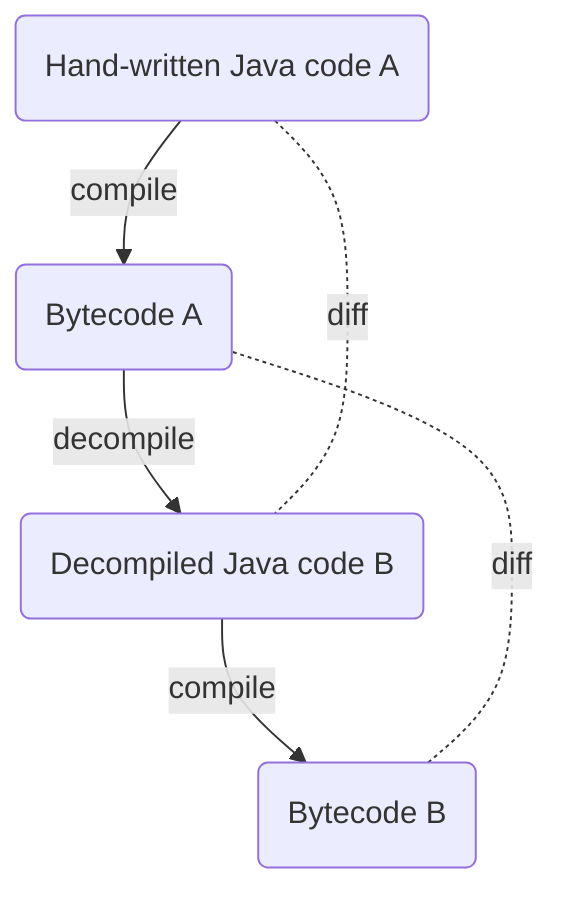

# Coding Dojo by LV 1871: Java bytecode assembly

## Werkzeuge in IntelliJ

* Compiler (nur bei Java-Dateien): Build > Recompile
* Decompiler (nur bei Class-Dateien): View > Show Decompiled Class
* Bytecode-Viewer (nur bei Class-Dateien): View > Show Bytecode
* Compiler-Settings: Settings > Build, Execution, Deployment > Compiler > Java Compiler > Additional command line parameters: ```-g``` und ```-g:none```

## Aufgabe: Round Trip in IntelliJ



Tipps:
* Das Hello-World-Programm erweitern, z.B. zwei lokale Variablen definieren und diese addieren
* Decompilierten Java-Code B in einer neuen Klasse (z.B. Main2) im `src`-Ordner speichern
* Compiler-Parameter ```-g``` und ```-g:none``` ausprobieren
* Diff zwischen Java-Code A und B bzw. Bytecode A und B anschauen

## Vorbereitung für die Kommandozeile: Java 8 einstellen

Alle hier gezeigten Kommandos benutzen die Bash, nicht Windows Command Prompt oder Windows Power Shell und müssen im Git-Wurzelverzeichnis ("`dojo-bytecode`") ausgeführt werden.

```shell
which java
```
```shell
which javac
```
```shell
export PATH=/c/Programme/AdoptOpenJDK/jdk-8-hotspot/bin:$PATH # Pfad entsprechend der eigenen Maschine anpassen!
```

Tipp: In IntelliJ kann man per "Project Structure > SDKs" ein JDK herunterladen!

```shell
java -version
```
```shell
javac -version
```

## JDK-Werkzeuge: javac und javap

```shell
javac -g:none -d out src/Main.java
```
```shell
java -cp out Main
```
```shell
javap -c -p -s -l -v out/Main.class
```

Achtung!
* Die Bytecode-Syntax von `javap` ist anders als die vom IntelliJ-Bytecode-Viewer
* Im JDK gibt es kein Gegenstück zu `javap`

Mehr Details zu den Kommandos gibt es hier:
* [javac - Oracle](https://docs.oracle.com/javase/8/docs/technotes/tools/windows/javac.html)
* [java - Oracle](https://docs.oracle.com/javase/8/docs/technotes/tools/windows/java.html)
* [javap - Oracle](https://docs.oracle.com/javase/8/docs/technotes/tools/windows/javap.html)

## 3rd-Party Assembler und Disassembler: Chasm

Disassembler:
```shell
java -jar lib/chasm.jar out/Main.class src/Main.chasm
```

Achtung: Die Bytecode-Syntax von Chasm ist erneut anders als die von `javap` und vom IntelliJ-Bytecode-Viewer!

Assembler:
```shell
java -jar lib/chasm.jar src/Main.chasm out/Main.class 
```

Nützliche Links:
* [Chasm - GitHub](https://github.com/minad/chasm)
* [List of Java bytecode instructions - Wikipedia](https://en.wikipedia.org/wiki/List_of_Java_bytecode_instructions)
* [The Java Virtual Machine Instruction Set - Oracle](https://docs.oracle.com/javase/specs/jvms/se8/html/jvms-6.html)

## Chasm-Aufgaben

### Einfacher

* Das Hello-World-Programm schrittweise in Java erweitern, z.B. eine (primitive) lokale Variable definieren und ausgeben
* Kompilieren (mit `javac` oder IntelliJ)
* Die kompilierte Klasse disassemblieren (mit Chasm) und den Bytecode verstehen (am besten mit Hilfe der Wikipedia-Liste)
* Den Bytecode manuell erweitern, z.B. eine zweite lokale Variable definieren
* Assemblieren (mit Chasm)
* Ausführen (mit `java` oder IntelliJ) und das Ergebnis prüfen/bewundern

Weitere Aufgaben nach dieser Art (Reihenfolge beliebig):
* eine primitive Klassenvariable definieren
* eine Objektvariable definieren
* eine Methode definieren
* eine Methode aufrufen
* eine statische Methode definieren und aufrufen
* eine if-Abfrage einbauen
* eine while-Schleife einbauen
* eine neue Klasse definieren
* usw.

### Schwieriger

* Ein lauffähiges Bytecode-Programm _from scratch_ schreiben, dabei nach und nach mehr Sprachkonstrukte einbauen (Variablen, if, while, Arithmetik, Methoden, Klassen etc.)
* Noch schwieriger: Diese Aufgabe ohne Zuhilfenahme eines Java-Compilers lösen, sondern nur mit der Liste der Bytecode-Instructions!

### Extra-Aufgabe(n)

* Ein lauffähiges Bytecode-Programm schreiben, das mit dem IntelliJ-Decompiler nicht (korrekt) dekompiliert werden kann!
* Alles andere, was Dir sonst noch einfällt!
