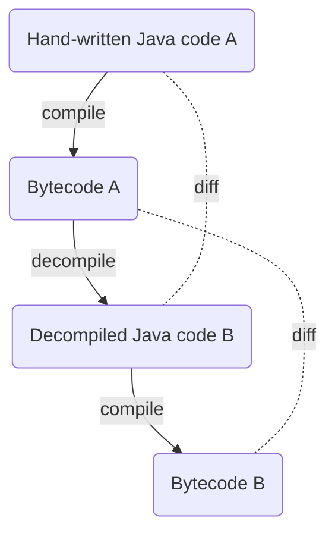

# Coding Dojo by LV 1871: Java bytecode assembly

## IntelliJ

* Compiler: Build > Recompile
* Decompiler: View > Show Decompiled Class
* Bytecode-Viewer: View > Show Bytecode
* Compiler-Settings: Settings > Build, Execution, Deployment > Compiler > Java Compiler > Additional command line parameters: ```-g``` und ```-g:none```

## Aufgabe: Round Trip



Tipps:
* Das Hello-World-Programm erweitern, z.B. zwei Zahlen addieren
* Decompilierten Java-Code B in einer neuen Klasse (z.B. Main2) im `src`-Ordner speichern
* Compiler-Parameter ```-g``` und ```-g:none``` ausprobieren
* Diff zwischen Java-Code A und B bzw. Bytecode A und B anschauen

## Vorbereitung: Java 8 einstellen

Alle hier gezeigten Kommandos benutzen die Bash, nicht Command Prompt oder Windows Power Shell.

```shell
which java
```
```shell
which javac
```
```shell
export PATH=/c/Programme/AdoptOpenJDK/jdk-8-hotspot/bin:$PATH # Pfad entsprechend der eigenen Maschine anpassen!
```
```shell
java -version
```
```shell
javac -version
```

## JDK: javac und javap

```shell
javac -g:none -d out src/Main.java
```
```shell
java -cp out Main
```
```shell
javap -c -p -s -l -v out/Main.class
```

## Chasm

Disassembler:
```shell
java -jar lib/chasm.jar out/Main.class src/Main.chasm
```

Assembler:
```shell
java -jar lib/chasm.jar src/Main.chasm out/Main.class 
```

## Aufgaben

* Änderungen am Bytecode vornehmen, z.B.:
* ... eine Variable definieren
* ... eine Methode aufrufen
* ... eine if-Abfrage einbauen
* ... eine while-Schleife einbauen
* ... eine neue Methode definieren
* ... eine neue Klasse definieren
* Ein lauffähiges Bytecode-Programm _from scratch_ schreiben

## Nützliche Links
* [javac - Oracle](https://docs.oracle.com/javase/8/docs/technotes/tools/windows/javac.html)
* [javap - Oracle](https://docs.oracle.com/javase/8/docs/technotes/tools/windows/javap.html)
* [Chasm - GitHub](https://github.com/minad/chasm)
* [List of Java bytecode instructions - Wikipedia](https://en.wikipedia.org/wiki/List_of_Java_bytecode_instructions)
* [The Java Virtual Machine Instruction Set - Oracle](https://docs.oracle.com/javase/specs/jvms/se8/html/jvms-6.html)
